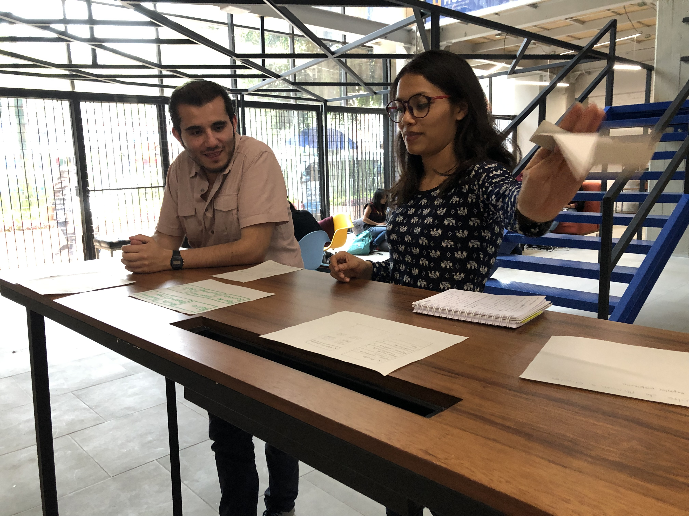
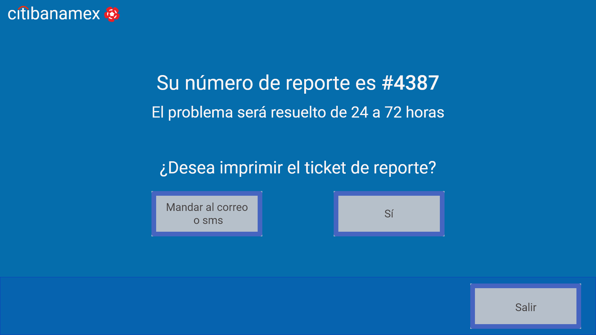
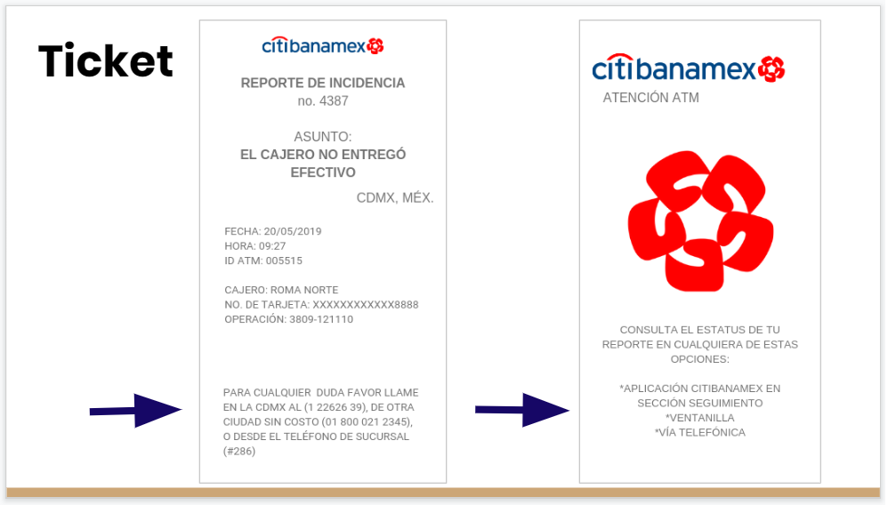
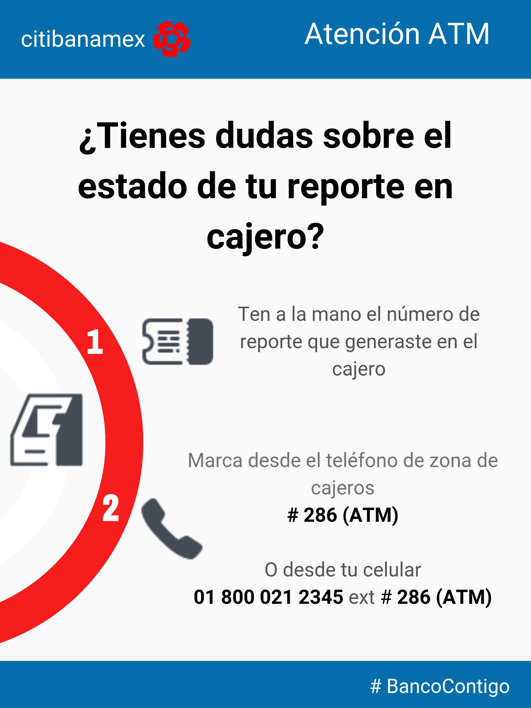

# Service Design: Citibanamex
El objetivo del proyecto es rediseñar la experiencia de servicio en cajeros automáticos para instituciones financieras.

De acuerdo a Nielsen Norman Group, Service Design se entiende como la actividad de planear y organizar los recursos del negocio; entendiendo estos como las personas, los procesos y accesorios, con el objetivo de mejorar directamente la experiencia del empleado e indirectamente la experiencia del consumidor.

## Hallazgos
De acuerdo al portal https://downdetector.mx/problemas/banamex/mapa/, se muestra el mapa de fallos de los bancos en México, siendo Citibanamex quien más fallos presenta. 
El principal problema de los cajeros de Citibanamex es que no entregan el dinero cuando lo solicitan, con cifras de Condusef fueron 22,256 reclamaciones por “No entrega cantidad solicitada”. 
Por tal motivo, Citibanamex fue la institución en quien se pensó realizar una propuesta de rediseño en su servicio de cajeros automáticos.

## Desarrollo del Proyecto
El Proyecto se desarrolló mediante el Diseño Centrado en el Usuario con enfoque en diseño de servicios. Así, se realizaron 43 encuestas a personas que utilizan el cajero ATM sin importar a qué institución financiera perteneciera, con el objetivo de conocer su experiencia usando este servicio. 
La encuesta se realizó en un form de google con un total de 10 preguntas abordando datos demográficos, experiencia con servicios bancarios y con cajeros ATM.
Los resultado fueron los siguientes. 

1. Rango de edad: 24-29 años
2. Principales bancos a los que pertenecen: Bancomer, Citibanamex, Santander y Banorte. 
3. Factores para elegir la institución bancaria: Asignación de cuenta por nómina, aplicación e inmersión digital y  ubicación por cercanía a su domicilio.  
4. Tiempo de uso: De uno a tres años. 
5. Frecuencia de uso del cajero ATM: De 3 a 5 veces al mes. 
6. Experiencia: buena.
7. Aspectos positivos de los cajeros ATM: fácil uso, rapidez y disponibilidad de cajeros. 
8. Peores experiencias en cajeros ATM: No entregan la cantidad solicitada pero sí se refleja el retiro en el ticket y dispositivos; los cajeros se tragan la tarjeta, están fuera de servicio, y el hay una demora en la fila. 
9. Problemas con el cajero ATM: la limpieza, el cobro de comisiones, la insufciencia de cajeros con servicio y la cantidad mínima a retirar. 
10. Características de un cajero ideal: que siempre tenga dinero, que no queden fuera de servicio, que sí entreguen el dinero solicitado.

## Técnicas y herramientas de investigación, ideación y prototipado
* **Investigación**: lectura y documentación sobre la situación bancaria en México, revisión de páginas web de bancos como citibanamex, Santander y BBVA Bancomer.
* **Benchmark**: comparación de páginas web, aplicaciones, funcionamiento y estructura de cajeros automáticos de bancos como citibanamex, Santander y BBVA Bancomer con el fin de saber qué era lo que estaban haciendo bien y cuáles serían las áreas de oportunidad de cada uno.
* **Lluvia de ideas**: en squad se propusieron ideas que podrían ser el problema a resolver.
* **Encuestas**: con base en nuestra primera hipótesis, el objetivo de la encuesta era confirmar o descartar si el principal problema de los tarjetahabientes estaba relacionado con el cobro de comisiones. Se realizaron 43 encuestas a personas que cuentan con una tarjeta bancaria. A partir de las respuestas se descartó la hipótesis inicial, pues las respuestas indicaban que el mayor problema ocurría cuando los usuarios querían realizar un retiro y no recibían dinero pero sí un ticket confirmando la transacción.
* **Entrevistas**: se eligieron 6 perfiles, 3 personas digitales y 3 no digitales con el fin de saber cuál era su experiencia al utilizar el servicio del cajero automático. Las respuestas de los entrevistados dieron paso a localizar los pains y gains del uso del servicio para, posteriormente, tener una ideación sobre la solución del problema.
* **Mapa de empatía**: nos ayudó a entender mejor al cliente a través de un conocimiento más profundo del mismo, su entorno y sus necesidades como usuario de cajeros automáticos.
* **User persona**: 2 perfiles con base en personajes imaginarios creados para representar los diferentes tipos de usuarios que podrían usar el servicio de un banco a través de un sitio web, una app o un cajero automático. Cada user persona contiene las motivaciones, frustraciones, actividades o rutinas, necesidades, pensamientos, rangos de edad, razones de usar cajeros automáticos, etc.
* **4w’s**: las preguntas (qué, quién, cuándo y por qué) sirvieron para confirmar quién era la persona que “sufría” y en qué momento del uso del servicio ocurría. Los cuestionamientos también ayudaron a pensar en los posibles actores para elaborar el mapa de stakeholders.
* **5 porqués**: serie de cuestionamientos en cadena que ayudaron a explorar consecuencias y las posibles causas de la problemática planteada. 
* **Mapa de stakeholders**: en este punto, el mapeo de los grupos de interés no fue planteado desde la organización sino desde el usuario, en este caso el tarjetahabiente. Como resultado, el mapa incluyó a los actores con los que el usuario podría interactuar en cualquier punto del journey map durante el uso del servicio. 
Observación en campo: visita a cajeros de bancos como citibanamex y BBVA Bancomer para ver el número de cajeros, comportamiento e interacción de las personas al entrar/salir del cajero, tiempo en que se realiza una operación, visualización de elementos dentro del cajero (carteles, botes de basura, teléfonos especiales, etc.), comparación de cajeros para ver si había una consistencia en el diseño y modelo de las máquinas.
* **Journey map**: ayuda a visualizar los momentos antes, durante y después de la interacción con los stakeholders, los momentos de dificultad y dolor al utilizar el servicio del cajero, las acciones y pensamientos del usuario que ayudan a pensar en la propuesta para solucionar el problema.

En la fase de Ideación para la propuesta de resolución de problema:
* **Idea garden**: así como la lluvia de ideas para proponer una hipótesis, la idea garden fungió como punto de partida sobre posibles soluciones con base en resultados de la encuesta sobre la pregunta “¿qué tendría tu cajero ideal?” y considerando la problemática: el cajero no entrega dinero pero sí un ticket confirmando la transacción de retiro de efectivo.
* **How might we**: con la pregunta “¿cómo podríamos?”, de manera colaborativa, se pensó desde los hallazgos y oportunidades cómo podría brindarse una solución: a partir del sistema de cajeros o de la atención al cliente. El resultado fue cuestionarse “¿cómo podríamos tranquilizar a los clientes que no reciben el dinero de un cajero?”
* **Crazy 8’s**: para generar ideas se recurrió a esta técnica para improvisar, retar la creatividad, adaptar y jugar partiendo de la pregunta propuesta con el How might we. Al utilizar las crazy 8’s estableciendo 8 minutos y 8 personajes se pudo proponer ideas viables, posibles y, tal como lo indica el nombre de la técnica, a ideas locas pero no imposibles. La imaginación y el no juzgar las ideas fue parte del éxito para continuar en la fase de ideación.
* **From gains to wow**: se enlistaron los aspectos o momentos que tenían conformes y/o satisfechos a los usuarios, así como los elementos que funcionan bien para mejorar aún más la experiencia al utilizar el servicio.
* **Clustering**: Una vez que se tenía identificado el problema, la hipótesis, las propuestas del idea garden, la pregunta del how might we, las ideas de las crazy 8’s, se procedió a categorizar las ideas por afinidad y complementación. 
* **Telescoping**: posterior al clustering, las ideas más sobresalientes fueron sometidas a votación sin perder de vista el problema, la hipótesis y el obetivo del proyecto.
* **Priorización (matriz de relevancia)**: en relación con el telescoping, las propuestas de solución se colocaron por eje de relevancia o efe de diferenciación.
* **FODA**: una vez que se eligieron las ideas más importantes y sobresalientes (viables, funcionales y de valor), se recurrió a un análisis considerando los aspectos internos y externos de cada solución respecto al problema.
* **Value proposition canvas**: análisis de la situación del negocio y del cliente para facilitar la toma de decisiones antes de comenzar a prototipar la solución del problema, para ello se consideraron obstáculos, frustraciones, beneficios, aspiraciones y las necesidades de cada uno.
* **Jerarquización de la información**: orden de pensamientos de acuerdo a la importancia, lo esencial y lo extremo, lo funcional, lo usable y lo wow. 

## Insights
* Las personas buscan el contacto humano para aclarar sus dudas sobre el proceso generado, de este modo disminuyen sus niveles de incertidumbre sobre el estatus de su queja.
* Las personas requieren del contacto humano para aclarar sus dudas para tranquilizarse con un seguimiento de parte del banco y un cierre efectivo.
* Las personas buscan comunicarse con otra persona para tener la certidumbre sobre el proceso generado.

## Prototipo
**Simulacro (baja fidelidad)**: propuesta hecha con lápiz en papel para simular la información que aparece en la pantalla de un cajero automático, elaboración y redacción de un ticket de reporte, un cartel y un teléfono ordenados. En el  prototipo se recurrió a una técnica mix de think aloud y walkthrough,  fue testeado con 7 personas. 
 
 

Una integrante del squad ponía en contexto al usuario, acompañó paso a paso del journey map al usuario a la vez que realizaba preguntas abiertas como “¿tú qué harías?” para lograr un diálogo profundo en donde las respuestas serían clave para iterar y encaminar la reestructura de la propuesta a la solución.
 

**Interactivo (Adobe XD, Marvel)**: después de iterar y corregir errores de mensaje, del flujo de navegación, etc. se plasmaron las ideas de bocetos a un prototipo de alta fidelidad por medio de Adobe XD y Marvel. De igual manera, se utilizaron las técnicas de think aloud y walkthrough.
Cabe mencionar que hay evidencias -fotografías y anotaciones- del testeo y las iteraciones realizadas.
 

**User test planning canvas**: ayudó a planificar cómo sería el testeo con los usuarios y qué actividades se le pedirían que realizara; asimismo, se consideraron las métricas de éxito y los elementos a observar. 
**User test analysis canvas**: los resultados permitieron comprobar si se cumplió el objetivo de cada tarea, los obstáculos y facilitadores. Se documentaron las observaciones como feedback para iterar el prototipo de baja fidelidad, así como también formaron parte de los hallazgos para considerar áreas de oportunidad que no estábamos considerando hasta el momento previo al testeo.

## Propuestas visuales
1. Solución desde los cajeros ATM
 
 
 

2. Tickets de reporte de problemas
 
3. Revisar el estado del reporte desde la app móvil.

4. Realizar levantamiento de reporte desde la página web.

5. Carteles en sucursales
 
6. Protocolo para personal de atención telefónica

7. Vídeo mostrando la solución: https://youtu.be/FjI1-xTmI34 

